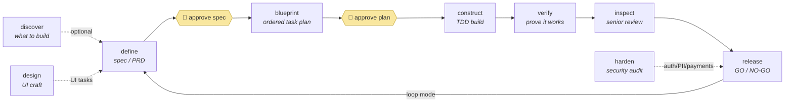

# Itqan — engineering skills suite

*إتقان — mastery of the craft.*

**One resumable orchestrator that runs the full software-engineering lifecycle — spec → plan → build → verify → review → ship — with approval gates you control and evidence required at every step.**

Pure Markdown skills for any capable AI runtime (Claude Code, Cursor, Codex, Gemini, …).
It adapts to your stack by reading your repo, never fires on its own, and keeps every
artifact in an `engineering/` workspace that survives sessions, machines, and hand-offs.



**📘 [The Book](docs/README.md)** — install in depth · first run · every skill's own page · playbooks · conventions · FAQ.

---

## Get started

**1 · Install** (any agent — Claude Code, Cursor, Codex, and more):

```bash
npx skills add saleh-alhaddad/itqan-engineering
```

**2 · Invoke** — name it; it never triggers itself:

```
itqan "add password reset to the auth service"
```

It scans your repo → asks the questions that matter (each with a suggested answer) → writes
a **spec you approve** → a **plan you approve** → builds test-first → proves it → reviews
it → **GO/NO-GO**. Nothing commits without you.

**3 · Resume** — days later, even on another machine:

```
itqan "continue"
```

It re-validates everything marked done — re-running tests, checking approvals were real —
and picks up at the first unproven step.

<details>
<summary><b>Other install paths</b> — Claude Code plugin · Cursor per-project · no Node · removal</summary>

| Path | Command | You get |
|---|---|---|
| **npx** *(above)* | `npx skills add saleh-alhaddad/itqan-engineering` | one skill: `itqan`, routing to all 12 (needs Node ≥ 22.20) |
| **Guided installer** | `curl -fsSL https://raw.githubusercontent.com/saleh-alhaddad/itqan-engineering/main/install.sh \| bash` | same — checks Node, offers upgrade, git fallback; add `-s -- --auto` for CI |
| **Claude Code plugin** | `/plugin marketplace add saleh-alhaddad/itqan-engineering` → `/plugin install itqan` | 12 skills, each invocable: `itqan:engineer`, `itqan:inspect`, … |
| **Cursor** | already covered by npx/installer (`~/.agents/skills/`) | per-project copy & details: [Book ch. 2](docs/02-installation.md#path-d--cursor) |
| **Any other runtime** | point its skill loader at this repo's root `SKILL.md` | the suite, degrading gracefully where a capability is missing |

Updating, verification, troubleshooting, and **clean removal**: [Book ch. 2](docs/02-installation.md).

</details>

---

## The skills

**The main flow** — the idea→ship spine, in order. `engineer` runs it end to end; each phase
is also invocable on its own.

| Skill | What it does |
|---|---|
| [engineer](docs/skills/engineer.md) | The whole lifecycle in one call — resumable, coordinates everything |
| [define](docs/skills/define.md) | Fuzzy idea → approved spec/PRD; owns schema & API-contract design |
| [blueprint](docs/skills/blueprint.md) | Spec → risk-first, dependency-ordered task plan |
| [construct](docs/skills/construct.md) | TDD build that follows your codebase's own patterns |
| [verify](docs/skills/verify.md) | Evidence before "done"; root-cause before any fix |
| [inspect](docs/skills/inspect.md) | Senior five-axis code review — read-only, fresh-eyes |
| [release](docs/skills/release.md) | Rollback-first shipping: staged rollout, GO/NO-GO, runbook |

**Shaping** — decide before the flow starts.

| Skill | What it does |
|---|---|
| [discover](docs/skills/discover.md) | What to build next / adopt — cited market scan, measured usage, ranked |
| [design](docs/skills/design.md) | UI/UX craft & audits for web + mobile; a UI Critical blocks release |

**Audits** — judge what already exists.

| Skill | What it does |
|---|---|
| [harden](docs/skills/harden.md) | Threat model + OWASP audit; an open Critical blocks the ship |
| [assess](docs/skills/assess.md) | Five-expert app health report: strong vs weak features, vs the market |

**People**

| Skill | What it does |
|---|---|
| [learn](docs/skills/learn.md) | Personalized learning roadmaps + codebase onboarding |

**Rule of thumb:** know exactly what and it's small → `construct` · know what, not how →
`engineer` · don't know what → `discover`/`define` · judge something → `inspect` / `design` /
`assess` / `harden` · prove it → `verify` · ship it → `release`.

---

## How you invoke it

**This suite never fires on its own — and that is enforced, not requested.** Every skill
declares `disable-model-invocation: true`, so no model can start one; the orchestrator runs
each phase by reading its file, not by triggering it. Words like *define* and *verify* turn
up in ordinary requests; the manifest keeps them words.

What you type depends on the install:

| Installed via | What registers | You invoke |
|---|---|---|
| **npx · installer · Cursor** | one skill: `itqan` | `itqan "…"` — the root router picks the phase |
| **Claude Code plugin** | 12 namespaced skills | `itqan:engineer "…"`, `itqan:inspect "…"`, … |
| **Other runtimes** | depends on the loader | ask by name: *"use the itqan skill to …"* |

> ⚠️ There is no shell command. The suite ships no executable — it is Markdown an agent
> reads. Name the skill inside your AI tool.

---

## What it guarantees

- **Two approval gates before code, GO/NO-GO before ship** — recorded in a ledger a resumed
  run cannot skip. Say **no** at a gate and the artifact is revised against your reason,
  never re-presented unchanged.
- **Evidence before claims** — tests run *now*, output read, and the count checked: zero
  tests collected is a discovery failure, not a green run.
- **Grounded, not guessed** — unknown facts are verified with citations, asked, or labeled
  suggestions; time-sensitive facts checked against today's web, not memory.
- **Review with no session in its head** — `inspect` and `harden` declare `context: fork`
  and rebuild what they need from the workspace, judging what is *written*, not what you
  meant.
- **Never commits, pushes, or writes outward without you** — per-file summary + risks +
  suggested message, then it waits. Commit messages never mention the AI.
- **Big changes are never big-banged** — characterization tests, an ADR, a strangler
  migration, and your explicit approval first.
- **Security is a scheduled gate** — auth/PII/payments automatically require a `harden`
  pass; an open Critical always blocks the ship.

### What your runtime enforces

| Guarantee | Claude Code | Cursor | Others |
|---|---|---|---|
| Never fires on its own | enforced | enforced | convention |
| Isolated-context reviews | enforced | fresh-eyes fallback | fresh-eyes fallback |
| Gates · evidence · ledger · resume | procedure | procedure | procedure |

Full matrix and what "fallback" means: [Book ch. 2](docs/02-installation.md#what-your-runtime-enforces).

---

## What it leaves in your project

One ordered workspace — **you choose where it lives and who sees it** on first run, once:

```
engineering/
├── profile.md            # how the suite operates here (role, paths, platform)
├── standards.md          # stack, conventions, branch/commit format, domain terms
├── decisions.md          # ADR-style decisions + why
├── index.md              # registry of every task + live status
├── changelog/<feature>/  # the app's memory: dated entry per change
└── tasks/0001-<slug>/    # per task: intake · spec · plan · reviews · summary
    └── state.json        # the phase ledger (status / validated / approved)
```

Distilled decisions only — never your source pasted verbatim, never raw PII.

---

## Honest limits

- **It does not judge whether code is well *shaped*** — measured, not assumed: an A/B on a
  seeded god-function found no difference. Treat review as a floor, not a human reader.
- **Approval gates depend on you actually reading** — the ledger records that you approved,
  not that you read.
- **PRs and tickets are untrusted input** — fetched content is treated as data, never as
  instructions; an injection attempt in a diff is reported as a finding. A rule is not a
  guarantee.
- **It is version 0.x** — conventions still change between versions.

More in the [FAQ](docs/06-faq.md). Found something broken?
[Open an issue](https://github.com/saleh-alhaddad/itqan-engineering/issues) with your OS,
shell, the skill, and the literal error text. Contributions: [CONTRIBUTING.md](CONTRIBUTING.md).

---

## Repo layout

```
├── SKILL.md                 ← root router (whole-suite installs)
├── CONVENTIONS.md           ← shared backbone (§1–§20) every skill reads
├── skills/<name>/SKILL.md   ← the 12 skills
├── references/disciplines/  ← stack + concern knowledge packs
├── templates/               ← workspace bootstrap scripts (bash · PowerShell)
├── docs/                    ← 📘 the Book
├── install.sh               ← guided installer
└── .github/                 ← CI: 7 structure guards + executable command tests
```

MIT — see [LICENSE](LICENSE).
