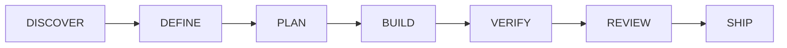

# 1 · Introduction

[← Book index](README.md) · [Next: Installation →](02-installation.md)

## What this is

A suite of **12 AI skills** that make an AI assistant work like a senior engineering
organization instead of a code generator. It runs the full lifecycle —

— with human approval gates before any code, test-first builds, evidence before any "done",
and a persistent workspace that lets work survive interruptions, machine changes, and
hand-offs between people or AIs.

It is **model-agnostic** (Claude, Codex, Gemini, Kimi, 70+ agents via the open SKILL.md
standard) and **stack-agnostic** (it reads your repo — backend, frontend, mobile, AI/ML, any
language — instead of assuming a framework).

## The problem it solves

AI assistants fail at engineering in predictable ways:

| Failure | The suite's answer |
|---|---|
| Builds the wrong thing from a vague ask | One-question-at-a-time intake → a spec **you approve** before any code |
| Claims "done" without proof | Evidence gate: tests run *now*, output read, real flow exercised |
| Loses the plot mid-task, forgets between sessions | The `engineering/` workspace + phase ledger — resumable, re-proven |
| Guesses facts, invents APIs and prices | Grounding rule: verify with citations, ask, or label as suggestion |
| Commits and pushes things you didn't want | Never commits without your approval; push always asks |
| Treats a typo and an architecture change the same | Size triage + role dial: ceremony scales with risk |
| Rewrites big systems in one risky shot | Characterization tests → strangler migration → ADR → your approval |

## The philosophy in five rules

1. **Intent before code.** A spec and plan you approved are the contract; nothing is built
   outside them without re-approval.
2. **Evidence before claims.** Every "it works" is backed by a fresh run someone actually read.
3. **The app remembers.** Every change lands in a dated per-feature changelog; decisions
   carry their *why*. "Why is this like this?" is answered from history, not vibes.
4. **The craft bar never moves.** A one-liner and a migration get the same correctness and
   honesty — the dial changes ceremony and delegation, never quality.
5. **You stay in command.** Approval gates, commit consent, GO/NO-GO, privacy disclosure
   before anything external — the human decides; the suite makes deciding easy.

## How it's organized

- **12 skills** — the verbs (`engineer`, `define`, `verify`…). Part II covers each in depth.
- **One backbone** — `CONVENTIONS.md` §1–§20: the shared rules every skill reads, so they
  never contradict each other. Explained humanly in [chapter 5](05-conventions-guide.md).
- **10 knowledge packs** — auto-loaded by what your change touches: stack packs (backend,
  frontend, mobile, ai-ml, any-language) and concern packs (database, security, devops,
  browser-verify, ui-craft).
- **Your workspace** — `engineering/` inside *your* project: specs, plans, reviews, the
  changelog, the ledger. The suite's memory lives with your code, not in a chat log.

[Next: Installation →](02-installation.md)
