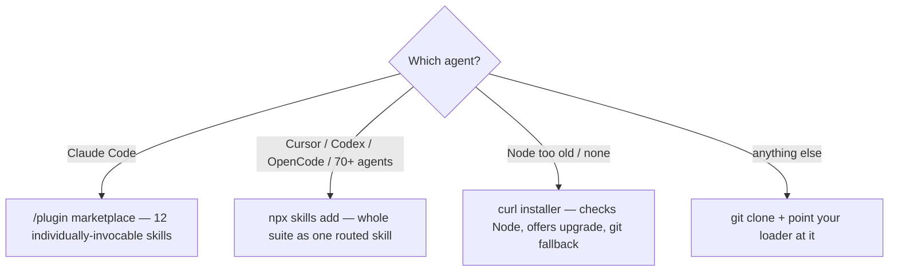

# 2 · Installation & removal

[← Introduction](01-introduction.md) · [Book index](README.md) · [Next: Getting started →](03-getting-started.md)

## Choosing your path



## Path A — One command, any agent

```bash
npx skills add saleh-alhaddad/itqan-engineering
```

Installs the whole suite as one skill (the root `SKILL.md` routes to all 12, with
`CONVENTIONS.md` and all packs intact) into every agent it detects — Claude Code, Cursor,
Codex, OpenCode, and more.

> **Requires Node ≥ 22.20.** On older Node you'll see `EBADENGINE` warnings then
> `SyntaxError: Unexpected reserved word`. That's your Node, not the suite.
> Fix: `nvm install 22 && nvm use 22`, or use Path B.

## Path B — Guided installer (handles Node for you)

```bash
curl -fsSL https://raw.githubusercontent.com/saleh-alhaddad/itqan-engineering/main/install.sh | bash
```

Checks your Node → offers the upgrade (via nvm when present) → installs; or falls back to a
plain-git install that needs no Node. Fully hands-off for teams/CI:

```bash
curl -fsSL https://raw.githubusercontent.com/saleh-alhaddad/itqan-engineering/main/install.sh | bash -s -- --auto
```

`--auto` = zero prompts, best path chosen automatically, any npx failure rescued by the git
fallback.

## Path C — Claude Code plugin (per-skill invocation)

```
/plugin marketplace add saleh-alhaddad/itqan-engineering
/plugin install itqan
```

Restart Claude Code. All 12 skills register as `itqan:<skill>`,
each invocable on its own — the richest experience. None of them fire by themselves; see
[How you invoke it](#how-you-invoke-it) below.

While the repo is private, add via SSH instead:
`/plugin marketplace add git@github.com:saleh-alhaddad/itqan-engineering.git`
(or a local clone path).

## Path D — Cursor

Cursor reads skills from four locations, and loads them from **any** of them:

| Location | Scope |
|---|---|
| `.agents/skills/` | this project |
| `.cursor/skills/` | this project |
| `~/.agents/skills/` | every project on this machine |
| `~/.cursor/skills/` | every project on this machine |

**Paths A and B already put the suite in the third one** (`~/.agents/skills/itqan`), so if you
ran either, Cursor has it — nothing else to do. Cursor also walks these folders recursively
and scopes a skill nested inside a subdirectory to the files under it, so a monorepo can keep
the suite next to the package it serves.

To install it into one project instead:

```bash
git clone --depth 1 https://github.com/saleh-alhaddad/itqan-engineering /tmp/itqan
mkdir -p .cursor/skills
cp -R /tmp/itqan/skills/. .cursor/skills/
cp -R /tmp/itqan/CONVENTIONS.md /tmp/itqan/references /tmp/itqan/templates .cursor/
rm -rf /tmp/itqan
```

Three things that layout gets right, and that are easy to get wrong:

- **`skills/.` not `skills`.** `cp -R src/. dst/` copies the *contents*. `cp -R src dst` puts
  the folder *inside* `dst` when `dst` already exists — and `.cursor/skills/` usually does —
  leaving `.cursor/skills/skills/`, where every `../../CONVENTIONS.md` silently misses.
- **`templates/` comes too.** When a sandbox blocks the workspace write, §20.1 offers a
  bootstrap script from `templates/`. Cursor is the runtime most likely to hit that — §20.1
  names its approval card and `.cursor/sandbox.json` by name — so it is the last place the
  remedy should be missing.
- **`CONVENTIONS.md` and `references/` sit beside `skills/`, not inside it.** A skill at
  `.cursor/skills/define/SKILL.md` resolves `../../CONVENTIONS.md` to `.cursor/CONVENTIONS.md`.

Cursor also needs each skill's `name` to match its folder — the suite already satisfies this,
and CI keeps it that way.

> User-level skills do not travel to Cloud Agents or remote SSH sessions. Install into the
> project (`.cursor/skills/`) for those.

## Path E — Any other runtime

A skill is a folder with a `SKILL.md`: YAML frontmatter, then Markdown. Nothing here is
executable. Point your runtime's skill or custom-instruction loader at the repo — start from
the root `SKILL.md`, which routes to all 12 — or paste one skill into the agent's context.

Keep `CONVENTIONS.md`, `references/`, and `templates/` two levels up from each `SKILL.md`, the
way the repo lays them out, and every cross-reference in the suite resolves. Where a
capability is missing — no subagents, no shell — the skills name the degrade in one line and
continue with the inline equivalent (§9).

## What your runtime enforces

Two of the suite's guarantees are declared in frontmatter, so how firmly they hold depends on
what your runtime honors. The rest are procedure, and travel everywhere.

| Guarantee | Claude Code | Cursor | Other runtimes |
|---|---|---|---|
| **Never fires on its own** — `disable-model-invocation: true` | enforced | enforced | convention: the skill says it, nothing stops it |
| **Reviews start with a clean context** — `context: fork` on `inspect`/`harden` | enforced | falls back | falls back |
| Approval gates, the evidence rule, the ledger and resume, workspace integrity | procedure | procedure | procedure |

"Falls back" is not "lost": §7 already carries the single-agent path for a fresh-eyes pass —
review from the artifact alone, with the acceptance criteria in hand — which is what the fork
automates. On a runtime that ignores `disable-model-invocation`, treat explicit invocation as
the house rule it was before the key existed: name the skill, and do not expect the runtime
to stop a model that decides otherwise.

<sub>Runtime capabilities verified 2026-09-01 against
[Cursor's skills documentation](https://cursor.com/docs/skills). Re-check before relying on a
row — this table is exactly the kind of fact §17 says goes stale.</sub>

## How you invoke it

**The suite never fires on its own.** Nothing here triggers from a keyword or a matched
description — you name the skill, and it takes over. A lifecycle with approval gates should
start when *you* decide, not when a phrase happens to match.

Every skill declares `disable-model-invocation: true`, so this is a property of the manifest
rather than a rule the model is asked to follow — no model can reach any of them, and the
orchestrator runs each phase by reading its file instead of triggering it as a skill.

> ⚠️ **There is no `engineer` command.** The suite ships no executable and no `commands/`
> directory. Typing `engineer "..."` at a shell, or describing a task and waiting for the
> suite to fire, does nothing.

**`engineer` is the entry point** — it routes to every phase itself. Invoke a phase directly
(`inspect`, `verify`, `harden`, …) when you want only that one; each bootstraps its own
workspace ([§1](05-conventions-guide.md)).

What you type depends on which path you installed:

| Path | What registers | You invoke |
|---|---|---|
| **A / B / D** (npx · curl · Cursor) | **one** skill: `itqan` | `itqan` — then say what you want; the root `SKILL.md` routes |
| **C** (Claude Code plugin) | **12** skills, namespaced | `itqan:engineer` — or `:inspect`, `:verify`, `:harden`, … |
| **E** (any other runtime) | depends on the loader | ask for it by name: *"use the itqan skill to …"* |

Examples throughout this book use the **Path C** form. On a single-skill install, drop the
`:<phase>` suffix and put the phase in the sentence instead.

## Verifying the install

Ask your agent: *"which skills do you have?"* — you should see the 12. Then smoke-test:

```
itqan:engineer "add a health-check endpoint"
```

Expect a detection report and questions — not instant code. That's the suite working.

## Updating

| Installed via | Update with |
|---|---|
| npx skills | `npx skills update` |
| Claude Code | `/plugin marketplace update itqan` then `/plugin update itqan@itqan` |
| Cursor manual copy | Re-run the Path D copy commands |
| git clone | `git -C <clone-path> pull` |

Updates replace only the skill files — your `engineering/` workspaces, code, and memory are
never touched.

## Removing — cleanly

**npx skills install:**
```bash
npx skills remove          # interactive; pick the suite
# or manually, from the project root:
rm -rf .agents/skills/itqan
rm -f .claude/skills/itqan .cursor/skills/itqan
# global variant: rm -rf ~/.agents/skills/itqan
# (older installs may use the previous folder name — remove whichever is present)
```

**Claude Code:**
```
/plugin uninstall itqan
/plugin marketplace remove itqan
```
Then restart Claude Code.

**Cursor manual copy:**
```bash
rm -rf .cursor/skills .cursor/CONVENTIONS.md .cursor/references
```

**What removal does NOT delete:** your projects' `engineering/` folders (your specs,
changelogs, decisions — they're yours, in your repos) and `learning/` folders. Delete those
yourself only if you truly want the memory gone.

[Next: Getting started →](03-getting-started.md)
