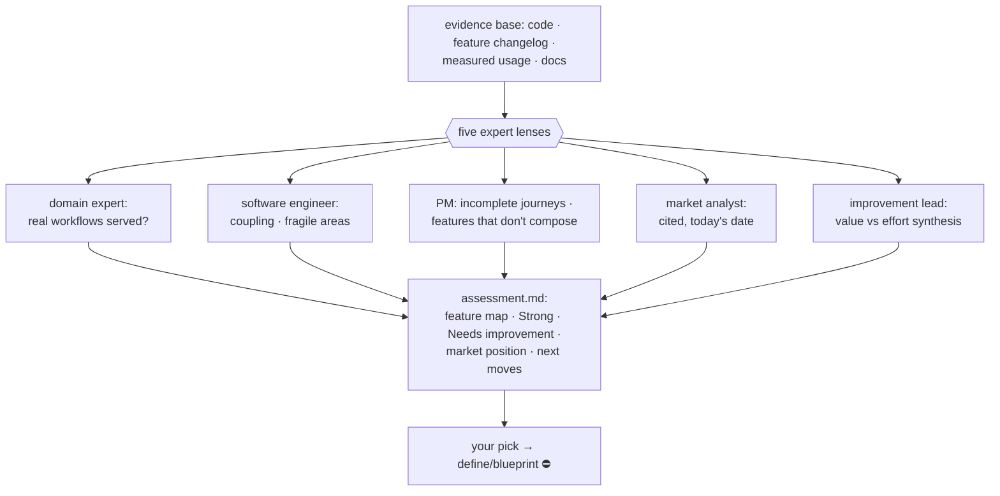

# assess — whole-app health

[← Book index](../README.md) · a five-expert panel over your product

**What it is:** the app-level review — not a diff, not a screen, the *product*: how features
link, which are strong, which are thin, and where you stand against the market.

## How it works



## Best cases

- **"Which features are weak?"** — periodic product health checks.
- **Before planning a big quarter** — its ranked "next moves" feed `discover`/`define`.
- **Inherited products** — a new owner's honest map of what's actually there.

## Example

```
itqan:assess "analyze my app — feature linkage, strong vs weak, vs the market"
```

## What you get

`assessment.md`: a feature-linkage map · **Strong** (with evidence — it says what's good,
not just what's wrong) · **Needs improvement** ranked by value-vs-effort with the concrete
fix and which expert flagged it · a cited market position. Optionally a throwaway prototype
of the top recommendation so you can *feel* it before deciding.

## Hand-offs

Approved improvements → `define` → `blueprint`, stopping at the normal plan gate. Net-new
ideation leads with `discover`; code-level review with `inspect`; security depth with
`harden`. Reuses the run's multi/single-agent answer instead of re-asking.

**Pro tip:** it asks two things up front — panel as parallel agents or one, and
report-only vs report+prototype. Pick report-only the first time; add the prototype when a
finding is worth feeling.
