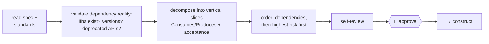

# blueprint — the ordered plan

[← Book index](../README.md) · approved spec → dependency-sorted, risk-first tasks

**What it is:** the PLAN phase. It makes the build boring: small vertical slices, each
independently verifiable, ordered so nothing is built before what it needs — ending at your
approval.

## How it works



## Best cases

- Anything too big for one pass; work you'll split across sessions or parallel workers.
- Plans that must survive reality: when `construct` finds a task infeasible, the
  **amendment loop** re-plans just the changed part and gets it re-approved (versioned).
  Trivial plan-silent choices don't take that loop: they're recorded as **rulings** in
  `intake.md` and the build continues — only changes to the approved shape need re-approval.

## Example

```
itqan:blueprint    # consumes the approved spec.md in the current task folder
```

## What you get

`plan.md`: tasks with Goal · Consumes/Produces · observable Acceptance · **Shape** (which
files, new abstraction vs reuse — with both options shown when it's a genuine choice) · Size (anything L
gets split — "and" in a title means two tasks) · live **Status** (the resume marker) ·
invariants/back-compat notes · parallelizable vs sequential marked for worker fan-out.

Before it reaches you, the plan gets a **fresh-eyes pass read from `plan.md` and `spec.md`
alone** (§7): every criterion maps to a task, and every task must be buildable from its
`Goal`/`Acceptance`/`Shape` **without asking the author what they meant** — the same bar a
worker agent or a colleague faces.

## Hand-offs

Consumes `define`'s spec; feeds `construct`. Product/roadmap planning is **not** here — that's
`discover`. Architect-level plans record ADRs in `decisions.md`.

**Pro tip:** highest-risk tasks are deliberately scheduled early — if the risky part fails,
you find out on day one, not day five.
