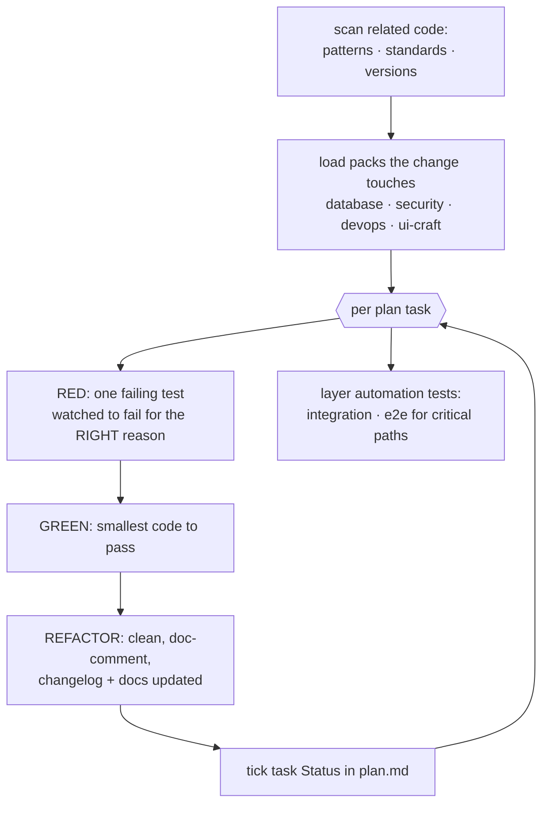

# construct — build it, test-first

[← Book index](../README.md) · TDD in your codebase's own style

**What it is:** the BUILD phase. It writes code the way this repo already writes code —
proven by tests written *before* the code, in thin slices that each leave the system green.

## How it works



## Best cases

- Executing planned tasks from `blueprint`.
- **Trivial fixes** — typos, config; zero ceremony but still branch + test + your commit.
- **Scoped optimizations** — "make this query faster" on existing code.
- Dependency work: adopting (license + health checked) or upgrading (one per change,
  changelog read, lockfile diff).

## Examples

```
itqan:construct "implement task 03 — the rate-limit middleware"
itqan:construct "fix the typo in the signup error message"
itqan:construct "optimize the slow product-list query"
```

## What you get

Code matching your repo's patterns, **modern idioms for your installed versions** (React 19
compiler ⇒ no manual `useCallback`; every ecosystem's equivalent), test-craft discipline
(real > fake > stub > mock, assert state, DAMP) and the falsifiability bar — every test must
name the production change that would break it, derive its expectation from the spec rather
than the code, and (for load-bearing behavior) survive a deliberate mutation check; the
string-presence and change-detector traps are called out by name, the feature changelog + docs updated **in
the same change**, and a per-slice circuit breaker (3 failed attempts → surface, don't
grind). Never commits by itself.

## Hand-offs

Consumes `plan.md` and `design.md` (UI); feeds `verify`. Review findings (from `inspect`,
`harden`, `design`, or a human) come back here as **claims to verify before implementing** —
a wrong finding gets reasoned push-back, not silent compliance. Plan silent on a trivial choice? construct records a **ruling** in `intake.md` and
continues. Plan actually wrong (approved shape changes)? Routes to `blueprint`'s amendment
loop for re-approval — and when unsure, it's an amendment. Unplanned multi-step "build X"? That's `engineer`.

**Pro tip:** "watch it fail for the right reason" is the whole trick — a test that passes before the
code exists is usually testing nothing. The one exception construct names: a **guard test**
asserting a valid input is still accepted may pass before the rule lands — it starts earning
its place the moment the rule arrives, by catching one that is too strict.
