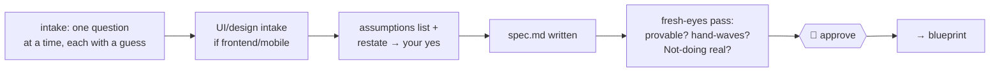

# define — pin the intent

[← Book index](../README.md) · idea → approved PRD, contracts included

**What it is:** the DEFINE phase. It converts a vague ask into a spec precise enough that
the plan and the tests can be written from it — without guessing, ending at your approval.

## How it works



## Best cases

- **Fuzzy ideas** — "I want notifications but haven't thought it through."
- **Schema / data-model / API-contract design** — "design the contract for orders" (this is
  define's job, not `design`'s — that one is visual UI).
- **UI features** — it collects mockups/Figma into `design.md` before anything is built.

## Examples

```
itqan:define "a realtime notifications feature — not sure of the details yet"
itqan:define "design the database schema and API contract for the orders service"
```

## What you get

`spec.md` with: objective · build ambition (MVP vs production) · testable success criteria ·
scope · **an explicit Not-doing list** (the scope-creep killer) · data model & contracts
(entities, invariants, retention/PII) · risks — plus every Q&A and reference link saved in
`intake.md`, and the assumptions surfaced *before* you approve. Before presenting, the
spec gets a **fresh-eyes pass read from the file alone** (§7): every criterion must name
what would prove it, hand-waves ("handle errors appropriately") get replaced, and an empty
Not-doing list is treated as unbounded scope — so what reaches your gate is checkable, not
just plausible.

## Hand-offs

Feeds `blueprint`. Reads tickets/docs from connected trackers as the requirement source.
Substantial UI shaping goes through `design`. Trivial one-liners skip define entirely.

**Pro tip:** the fastest sessions answer with single words — every question carries a guess
precisely so you can just say "yes" or correct it.
