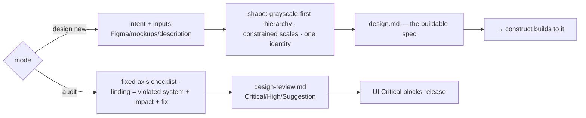

# design — UI/UX craft

[← Book index](../README.md) · distinctive interfaces, evidence-based audits

**What it is:** the visual/interaction craft skill for web and mobile — three modes: design
new, improve existing, or audit. Backed by `ui-craft.md`, a universal 27-rule reference
distilled from the best design systems and skills surveyed.

## How it works



## Best cases

- **"It works but looks generic"** — escaping the AI-aesthetic (default gradients,
  over-rounding, template heroes) with a product-grounded identity.
- **UI audits** — spacing, hierarchy, states, accessibility, against *your own* design system.
- **Mockups → build-ready spec** — Figma/screenshots distilled into `design.md` with
  screens, states (loading/empty/error/success), tokens, motion, a11y and i18n/RTL notes.

## Examples

```
itqan:design "make the analytics dashboard feel premium — audit spacing, hierarchy, states"
itqan:design "design the mobile onboarding screens from these Figma frames"
```

## What you get

Either a `design.md` the build follows exactly, or `design-review.md` where every finding
cites the violated token/system rule + demonstrated impact + deterministic fix — ranked like
code review, and **a UI Critical (broken core flow, inaccessible primary action) blocks
release** just like a code Critical. Product identity is preserved, never flattened to
generic "best practice".

## Hand-offs

Feeds `define`'s UI intake and `construct`'s build; fixes route construct → verify. **Not**
for schema/API design (that's `define`) or code review (`inspect`).

**Pro tip:** no design system yet? It suggests a stack-appropriate default (confirmed with
you, never imposed) and records the choice so every later screen matches.
