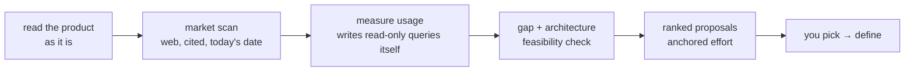

# discover — what to build next

[← Book index](../README.md) · grounded feature proposals & tool evaluation

**What it is:** the pre-DEFINE research skill. It answers "what should we build?" and
"should we adopt X?" with cited evidence and measured usage — never invented competitors,
prices, or numbers.

## How it works



## Best cases

- **Roadmap planning** — quarterly "what's next", table-stakes vs differentiators.
- **Tool / platform evaluation** — pros/cons, current pricing, license limits, integration
  fit, lock-in (e.g. OpenStreetMap → Google Maps).
- **"Are our features enough?"** — though whole-app *health* judging belongs to `assess`;
  discover leads on *net-new*.

## Examples

```
itqan:discover "our invoicing SaaS has 200 users — what should we build next?"
itqan:discover "we use OpenStreetMap — evaluate switching to Google Maps: pros/cons, pricing, fit"
```

## What you get

`discovery.md`: current state → cited market scan (checked at **today's** date) →
usage/goal context (measured where possible, asked where not) → ranked proposals, each with
evidence, target first-users, effort anchored to the modules it touches, and a validation
path (MVP/prototype).

## Hand-offs

Chosen proposals flow to `define`. Adopted tools get an ADR and `construct`'s
dependency-adoption checks (license, maintenance health). `assess`'s "next moves" feed in
as input.

**Pro tip:** have rough usage numbers handy (users, feature usage) — it will measure what it
can from your own schema and ask only for the rest; ranking quality tracks data quality.
