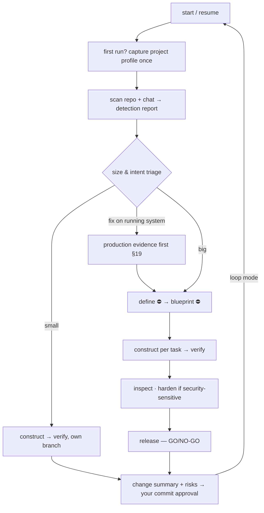

# engineer — the orchestrator

[← Book index](../README.md) · run the whole lifecycle in one call, resumably

**What it is:** the entry point for any multi-step work. It doesn't do everything itself —
it detects, triages, sequences the other skills, enforces the gates, and guarantees nothing
is skipped or falsely claimed done.

## How it works



On **resume**, it walks the ledger backward first: every phase marked done is re-proven
(tests re-run, approvals verified) before any new work.

## Best cases

- **"Build X" with no plan yet** — greenfield or feature; it plans first, then builds.
- **"Continue"** — after any interruption, days or machines later.
- **A backlog** — loop mode runs task after task with a commit gate between each.
- **A fix on production** — it pulls the evidence (logs/metrics/queries) before deciding.

## Examples

```
itqan:engineer "add per-API-key rate limiting to the public API"
itqan:engineer "continue"
itqan:engineer "orders sometimes lose their discount — find how often and fix it"
```

## What you get

Detection report → stated role → both approval gates → TDD build with evidence → review →
GO/NO-GO — every artifact in `engineering/tasks/NNNN-…/`, every change in the feature
changelog, and **your** commit approval at the end.

## Hand-offs

Calls all six phase skills; routes ideation to `discover`, UI intake to `design`, security-
sensitive changes to `harden` automatically. Already-planned single tasks and one-liners
belong to `construct` directly.

**Pro tips:** answer the orchestration questions once, in one exchange with the build-ambition ask —
`multi/single` · `loop/step` · commit consent `gate/pre-approved` (plus `loop-auto` in loop mode) —
they're remembered per run. In loop mode you may explicitly opt into auto-commit+push per
task for hands-off backlogs.
