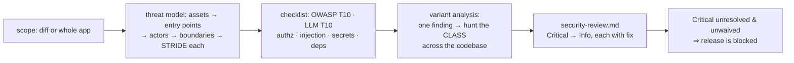

# harden — the security audit

[← Book index](../README.md) · threat-model first, class-level findings

**What it is:** the dedicated security skill — scheduled automatically for anything touching
auth, PII, payments, or a new public surface, and invocable any time you want an audit.

## How it works



## Best cases

- **Before going public** with an API or app.
- Auth flows, payment integration, file uploads, new external integrations — the **Ask-First
  list**: building these needs your explicit OK before construction, not just review after.
- Dependency scares — audit findings triaged by **reachability**, never force-auto-fixed.

## Examples

```
itqan:harden "security review before we expose this API publicly"
itqan:harden "threat-model the payments flow"
```

## What you get

`security-review.md` ranked Critical→Info by **reachability × impact** (who can reach it ×
what they get — a category name never sets the rank), where every finding names its actor
and has a **violated boundary +
demonstrated impact + concrete fix** (no "could be risky" filler), current advisories checked
at today's date, and **variant analysis** — the report names the *class* and every location,
not one lucky instance. Waiving a finding requires your explicit, recorded acceptance.

## Hand-offs

Fixes route through `construct` → `verify` → re-audit of the changed part. `release` treats
an open Critical as an automatic NO-GO. General code quality stays with `inspect`.

**Pro tip:** run it once on the whole app before your first public launch — the first audit
sets the baseline the per-change audits then keep clean.
