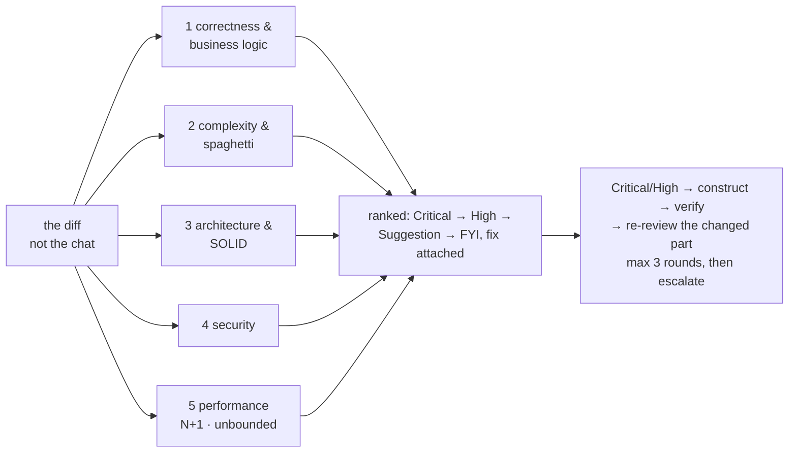

# inspect — senior code review

[← Book index](../README.md) · five axes, read-only, noise-filtered

**What it is:** the REVIEW phase — a fresh-eyes, adversarial read of the *diff* (not the
session that produced it), reporting only findings a good engineer would act on, each with
its fix.

## How it works



## Best cases

- Pre-merge gate on your own work; **reviewing a teammate's PR** (fresh context is the point).
- Security-sensitive or perf-suspect diffs; **cross-service changes** (it checks shared
  contracts and names the services to re-verify).
- **Dependency upgrades** — changelog read? lockfile diff reviewed? one dep per change?

## Examples

```
itqan:inspect "review PR #482 — bugs, security, performance, cross-service impact"
itqan:inspect "is the error handling in payment-service any good?"
```

## What you get

`review.md` with ranked findings — business-logic traced, spaghetti flagged with the
decomposition, structural perf problems (N+1, unbounded fetches), size guidance (~1000 lines
⇒ should have been split) — and *"clean review is a valid result"*: no invented nitpicks.

## Hand-offs

Consumes `verify`'s proven change; feeds `release` (Critical/High block it). Read-only —
fixes go through `construct`. UI craft review is `design`; whole-app health is `assess`;
deep security is `harden`.

**Pro tip:** point it at a branch or PR and it reads the diff from your connected VCS; no
git available, it reviews the changed files directly.
