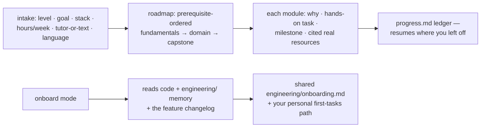

# learn — roadmaps & onboarding

[← Book index](../README.md) · personalized paths, team onboarding, tracked progress

**What it is:** the people skill — a level-adaptive learning system for mastering a stack or
role, and an onboarding engine for ramping anyone onto an existing codebase.

## How it works



## Best cases

- **Role roadmaps** — "get me job-ready backend in 8 hrs/week" — with what-you-already-know
  verified and skipped, not assumed.
- **New-hire onboarding** — one *shared* `engineering/onboarding.md` the whole team refreshes
  (architecture, key flows, where things live), plus a per-person task path.
- **Guided deep-dives** — proactive-tutor mode explains, sets exercises, checks answers, and
  only advances on met milestones; in any language (English, Arabic, …).

## Examples

```
itqan:learn "I know Python basics — get me to job-ready backend engineer, 8 hrs/week"
itqan:learn "onboard me onto this repo — I'm a mid-level backend engineer"
itqan:learn "teach me system design step by step, in Arabic, quiz me as we go"
```

## What you get

A `learning/` workspace: `roadmap.md` (visual, prerequisite-ordered, milestones + hands-on
projects), `progress.md` (the resume ledger), per-module notes/exercises — resources are
**real and cited**, never invented links. Onboarding answers "why is it built this way?"
from the changelog — the app's recorded memory — and lists what only the team can answer.

## Hand-offs

Capstones and practice projects build for real via `engineer`/`construct`. `engineer` never
routes here — `learn` is a door you open yourself.

**Pro tip:** for onboarding, run it *after* the team has used the suite a while — the richer
the feature changelog, the better the "why" answers a new hire gets.
