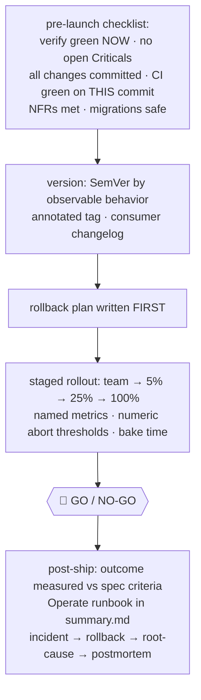

# release — ship safely

[← Book index](../README.md) · rollback first, GO/NO-GO, then prove the outcome

**What it is:** the SHIP phase — the last gate before production and the loop-closer after
it. Shipping is an explicit decision with evidence, never an afterthought.

## How it works



## Best cases

- User-facing launches that need staged rollout and a tested way back.
- Closing out any task — even internal ones get the single-step collapse *plus* the
  rollback note and runbook.
- The moment after ship nobody does: **did the change actually work?** It reads the spec's
  success metric back with real data.

## Example

```
itqan:release "ship the new onboarding flow to production"
```

## What you get

A written GO/NO-GO block (evidence · integration step · rollout with thresholds · rollback)
· version + tag + Keep-a-Changelog entry in the same change · an **Operate** runbook for
on-call (dashboards, alerts, rollback command, failure modes, escalation) · an **Outcome**
line proving the change worked, not just ran.

## Hand-offs

Consumes `inspect`/`harden`-cleared, `verify`-green work. NO-GO routes back with the reason.
In loop mode, a healthy GO pulls the next task. Incidents post-ship: rollback → `verify`
Part B → postmortem into `decisions.md`.

**Pro tip:** write the abort thresholds as numbers *before* stage one — "watch it closely"
is not a rollout plan, "error rate > 2% for 5 min ⇒ roll back" is.
