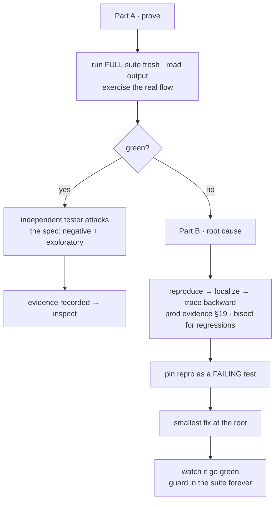

# verify — prove it works

[← Book index](../README.md) · evidence before "done" · root cause before any fix

**What it is:** the suite's honesty engine. Part A proves a change works with fresh
evidence; Part B root-causes failures before anything is "fixed".

## How it works



## Best cases

- Before any "it's done" claim; re-proving old work on resume.
- **Any bug report** — including production ones (it starts from logs/metrics/error
  trackers) and non-reproducible ones (timing/environment/state classification).
- UI verification — via the browser pack: console-clean gate, a11y-tree reads, screenshots.

## Examples

```
itqan:verify "run everything and confirm the checkout flow actually works"
itqan:verify "orders lose their discount sometimes — root-cause it"
```

## What you get

An evidence-backed pass/fail (command + output, not vibes) · flaky tests **quarantined as
defects**, never re-rolled to green · scanners must not regress on changed scope · for bugs:
a regression test that pins the root cause forever. And the honesty rule: no execution
capability ⇒ *"cannot verify"* + the exact command for you — never a fabricated green.

## Hand-offs

Consumes `construct`'s output and the spec's criteria; feeds `inspect`. Migration checks come
from the database pack (up **and** down, prod-shaped data, locks recorded).

**Pro tip:** for production bugs, let it write the read-only queries from your schema — "how
often, who, since when" usually finds the repro faster than staring at code.
